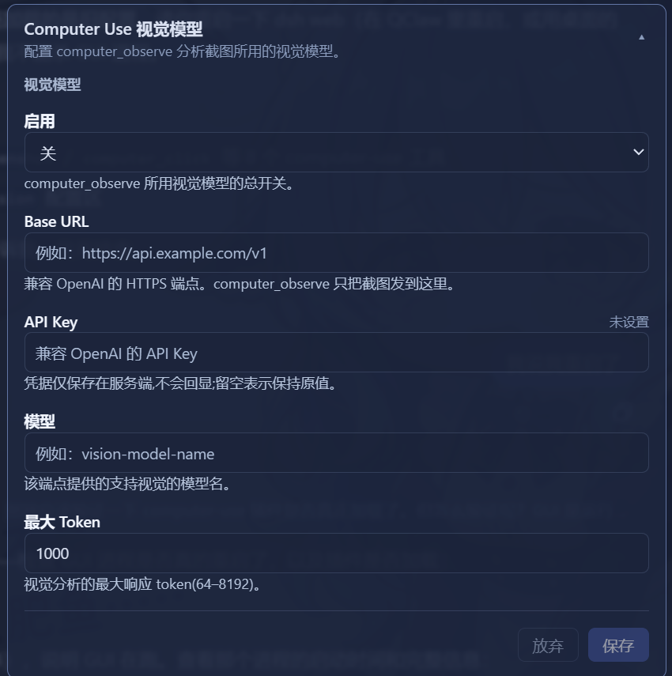

# DSH Computer Use

[中文](README.zh-CN.md)

Native Windows Computer Use bundle for [DeepSeek Harness](https://github.com/deepseek-ai/deepseek-harness). It uses the DSH Cordis tool registry directly and does not use MCP. Verified against DSH `0.1.1-rc.1`.

## Capabilities

- `computer_screenshot`: captures the virtual desktop and returns a DSH image attachment.
- `computer_click`, `computer_drag`, `computer_scroll`: pointer control using bounded virtual-desktop coordinates.
- `computer_type`, `computer_keypress`: Unicode text and supported keyboard shortcuts sent to the active control.
- `computer_wait`: allows an application to settle before the next observation.
- `computer_observe`: captures the desktop and sends it to a user-selected vision model when the active DSH model cannot inspect images.

Every Computer Use tool asks through DSH's native approval service by default. `CTRL+ALT+DELETE`, empty text, unsupported keys, invalid durations, and coordinates outside the virtual desktop are rejected before input is sent.

## Permissions and approvals

> **If a `computer_*` tool reports `the user rejected tool "computer_screenshot"` without any prompt:** this usually is *not* a real user refusal. When the session runs under `approval: never` (for example a `danger-full-access` preset), approval-required tools are **fail-closed and auto-rejected**, and the error text is misleading. Type `/permission workspace-write` (approval = ask) in the conversation input box to restore the approval prompts.

Two independent gates guard every computer action:

- **Master switch** (since 0.2.2): the **Computer Use: On/Off** pill on the right side of the composer toggles the `computer-use-control` setting. When disabled, all `computer_*` tools are denied with an explicit reason.
- **Approval gate**: `tools/pre-execute` returns an `ask` request for every `computer_*` call while `requireApproval` is `true` (the bundled `cordis.patch.yml` keeps it enabled). Turn it off only if you accept running computer actions without confirmation; changing it requires a DSH restart.

## Vision model settings

After installing and restarting DSH, open **Settings > Plugins > Plugin configuration**, then expand **Computer Use Vision**. Enter an OpenAI-compatible HTTPS base URL, API key, vision-capable model name, and response-token limit, then enable the model. The API key is stored in DSH's settings secret field and is not included in Cordis configuration or tool responses.

| Field | Requirement |
| --- | --- |
| Enabled | Turn this on only after the endpoint, key, and model are configured. |
| Base URL | An HTTPS OpenAI-compatible API base URL, such as `https://api.example.com/v1`. |
| API Key | Stored as a write-only DSH secret. Leaving the field blank during an update preserves the existing key. |
| Model | The vision-capable model identifier accepted by the provider. |
| Max Tokens | An integer from `64` to `8192`; the default is `1000`. |

`computer_observe` sends the current screenshot only to this configured endpoint. Keep it disabled unless you understand where the visual data will be processed.



### Why this appears in the settings UI

DSH only exposes selected settings namespaces to its browser configuration API. The plugin registers the vision configuration as a configurable model provider, so the native Web UI can safely read and save it. Computer-control tools are loaded separately, preventing their runtime dependencies from delaying the settings card.

## Install

From npm (recommended). `--profile` is required — it selects which DSH profile gets the plugin:

```powershell
dsh plugin --profile web add @crazy_th/dsh-computer-use
```

Replace `web` with the profile you actually use (`tui`, `headless`, ...).

From source (development):

```powershell
pnpm install
pnpm run build
dsh plugin --profile web add link:<path-to-this-checkout>
```

Restart DSH after installation. To inspect the active layer:

```powershell
dsh --profile web --dump-config
```

The bundled `cordis.patch.yml` enables approval and scales screenshots to at most 1600x1200. Override those values in the profile's `cordis.patch.yml` when needed.

### Verify the installation

The composed configuration must contain both `computer-use-settings` and `computer-use`:

```powershell
dsh --profile web --dump-config
```

For the Web profile, start DSH on the default local port and open the page locally:

```powershell
dsh web --port 3082
# Open http://127.0.0.1:3082, then Settings > Plugins > Plugin configuration.
```

If the card is absent, restart DSH after rebuilding or reinstalling the plugin. Do not use a cached page from a different DSH instance or profile.

## Development

```powershell
pnpm test
pnpm run typecheck
pnpm run build
```

The automation driver is Windows-only. It uses `user32.dll` for input and `System.Drawing` for screen capture; it does not install a global hook or run a background process.

## License

MIT
